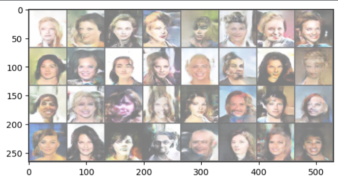

# 🚀 DCGAN Face Generation using PyTorch

## 📝 Note

> **Note:** The complete training notebook (`DCGAN.ipynb`) is not included in this repository because the notebook file exceeded GitHub's size limit after training and saving outputs. This repository showcases the project overview, model architecture, results, and implementation details.

A PyTorch implementation of **Deep Convolutional Generative Adversarial Networks (DCGANs)** trained on the **CelebA dataset** to generate synthetic human face images.

Unlike a Vanilla GAN, DCGAN leverages **Convolutional** and **Transposed Convolutional** layers, enabling the model to preserve spatial information and generate more realistic facial structures.

---

## 📸 Sample Results

<p align="center">
  
</p>

> Sample faces generated after **5 training epochs**.

---

## 📌 Project Overview

This project demonstrates how a **Generator** and a **Discriminator** compete against each other in an adversarial training process.

- **Generator** learns to create realistic face images from random noise.
- **Discriminator** learns to distinguish between real and generated images.
- Both models improve simultaneously through adversarial learning.

---

## ✨ Features

- Deep Convolutional GAN (DCGAN)
- Trained on the CelebA Dataset
- PyTorch Implementation
- Image Generation using Random Noise
- Binary Cross Entropy (BCE) Loss
- Adam Optimizer
- Batch Normalization
- LeakyReLU & ReLU Activations
- Tanh Output Layer

---

## 🧠 Model Architecture

### Generator
- Random Noise (100-dimensional latent vector)
- Transposed Convolution Layers
- Batch Normalization
- ReLU Activation
- Tanh Output

### Discriminator
- Convolution Layers
- Batch Normalization
- LeakyReLU Activation
- Sigmoid Output

---

## 📂 Dataset

### CelebFaces Attributes Dataset (CelebA)

- **Total Images:** 202,599
- **Identities:** 10,177
- **Image Size:** 178 × 218 RGB

**Dataset Link**

https://www.kaggle.com/datasets/jessicali9530/celeba-dataset

---

## 🛠️ Technologies Used

- Python
- PyTorch
- Torchvision
- NumPy
- Matplotlib
- Pillow
- Google Colab

---

## 📁 Project Structure

```text
dcgan-face-generation/
│
├── results/
│   └── epoch_5.png
│
├── DCGAN.ipynb
├── README.md
└── requirements.txt
```

---

## 🚀 Installation

```bash
git clone https://github.com/your-username/dcgan-face-generation.git

cd dcgan-face-generation

pip install -r requirements.txt
```

---

## ▶️ Training

Run the notebook or training script to start training the DCGAN.

---

## 📈 Loss Function

**Binary Cross Entropy Loss (BCELoss)**

---

## 📊 Training Details

| Model | Dataset | Epochs |
|--------|---------|--------:|
| DCGAN | CelebA | 5 |

---

## 📚 What I Learned

- Deep Convolutional GAN (DCGAN)
- Generator & Discriminator Training
- Binary Cross Entropy Loss
- Batch Normalization
- Transposed Convolutions
- Image Generation using Deep Learning
- Working with Large Image Datasets
- Training GANs using PyTorch

---

## 🔮 Future Improvements

- Train for 100+ epochs
- Higher Resolution Face Generation
- Wasserstein GAN (WGAN)
- Conditional GAN (CGAN)
- StyleGAN
- Progressive GAN

---

## ⭐ Acknowledgements

- CelebA Dataset
- Kaggle
- PyTorch
- Google Colab

---

## 👩‍💻 Author

**Vaishnavi Rathi**

If you found this project useful, consider giving it a ⭐ on GitHub.
